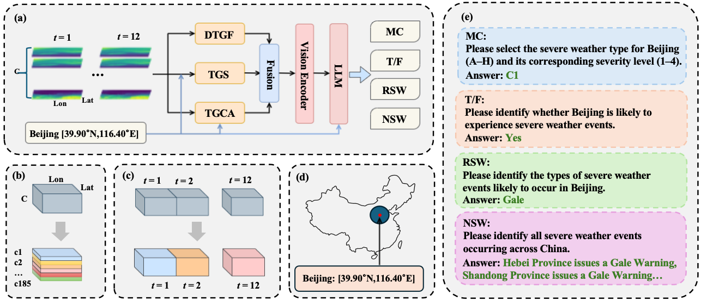

<div align="center">
  
  <h1 style="font-size: 32px; font-weight: bold;"> MeteorPred: A Meteorological Multimodal Large Model and Dataset for Severe Weather Event Prediction </h1>

  <br>

</div>


## MeteorPred

> The first multimodal large model that directly interprets 4D meteorological data and generates severe weather warnings.



Contributions:
- We have collected MP-Bench, a dataset for severe weather events prediction that provides nationwide scope, year-round coverage, and a rich variety of Q&A formats.
- Based on this dataset, we proposed MMLM, integrating three plug-and-play modules that enhance feature extraction in temporal, spatial, and vertical dimensions, respectively, collectively improving its ability to capture complex meteorological patterns.

- To the best of our knowledge, this is the first time that MLLM has been used to deeply interpret raw meteorological data and generate warning conclusions in sentence form, paving a whole new perspective for future severe weather warning missions.

- We observed an emergence of thinking pattern during RL training process, such as visual search for small objects, visual comparisons across different regions, using `image_zoom_in_tools` for answer verification, etc. Check [our project homepage](https://visual-agent.github.io/) for more case study.


## Dataset

### 1. MP-Bench

We release the raw severe weather warnings for both 2023 and 2024, available as `dataset/2023_severe_weather_warnings.csv` and `dataset/2024_severe_weather_warnings.csv`, respectively.

---

### 2. Raw Meteorological Data

The ERA5 pressure-level data (`.pth` format) used in this project can be obtained from the official Copernicus Climate Data Store (CDS):

👉 [ERA5 Reanalysis Dataset](https://cds.climate.copernicus.eu/datasets/reanalysis-era5-single-levels)

Please refer to the link above for data access and download instructions.


## Citation

```
@inproceedings{tang2026meteorpred,
  title={Meteorpred: A meteorological multimodal large model and dataset for severe weather event prediction},
  author={Tang, Shuo and Xu, Jian and Zhang, Jiadong and Chen, Yi and Jin, Qizhao and Shen, Lingdong and Liu, Chenglin and Xiang, Shiming},
  booktitle={Proceedings of the IEEE/CVF Conference on Computer Vision and Pattern Recognition},
  pages={22910--22919},
  year={2026}
}

```
